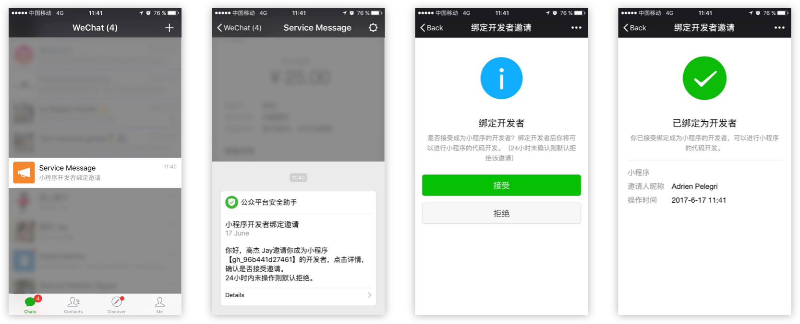

China’s top messaging app WeChat rolled out something quite radical: **mini-programs**. Embedded apps which require no download, no install. Open, use, share, done!

This crash course will get you up and running with WeChat mini-programs, and teach you the core knowledge you need to deeply understand and build mini-programs quickly.

*Here are two examples:*

👉 [SeeMe](http://seeme.ninja/) (built by Le Wagon batch#61 students)

👉 Le Wagon Talents Recruitment (available in the official account)

# MP course: prep work

1.  Basic knowledge in Javascript
2. Download and master WeChat IDE (development tool)
3. WeChat mini-program dashboard tutorial
4.  Accept the notification you received

## 1. Javascript for beginners

Let's review the JavaScript core notions through this video, [Javascript for beginners](https://www.youtube.com/watch?v=BEJ3d6IgmVk).
If you are already familiar with Javascript move to the next step.

## 2. WeChat IDE

The Wechat IDE (*Integrated Development Environment*) is a development tool provided by Tencent to do all the code and preview your mini-program.

**Download the WeChat IDE and discover its main features** by reading this [tutorial](https://github.com/apelegri/wechat-miniprogram-wiki#wechat-ide).

## 3. WeChat dashboard

We've prepared a short doc introducing the WeChat mini-program [admin dashboard](https://mp.weixin.qq.com/) and how to take the most of mini-program dashboard features.

👉 [Download the PDF](dashboard-presentation.pdf)

## 4. Accept the notification!

To become a developer in WeChat, you need to be authorized and attached to a Mini Program.

No worries, you don't need to register this MP just yet, we did it for you. Just accept the notification to be able to edit our playground project and use our **AppID**.

# What will you learn?

- Master fundamental mechanisms behind the WeChat mini-program framework.
- Realize the power of building mini-program through quick prototyping.
- Become fluent in the fast-growing WeChat mini-programs market.

### Happy Mini Programming!
